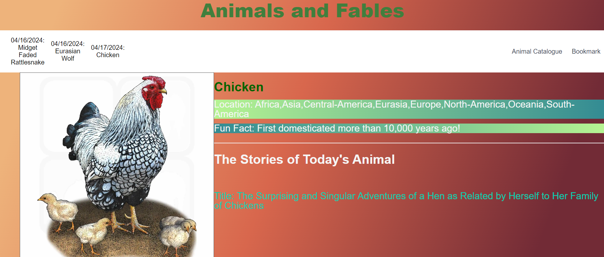
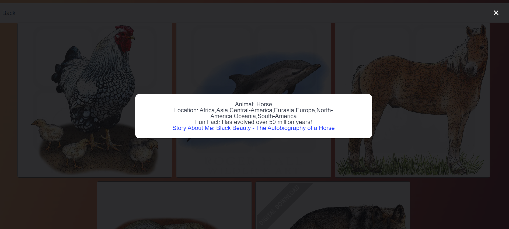

# Animals and Fables

## Description  

- We love animals. This website will provide a means to experience information about well known and loved creatures.  

- We like to pull the information and related books about our favorite animals easily.

- It will save the time for searching out lovely animals.

- We have learned how to build a web application as a team.

[Github Repo](https://github.com/sentorus67/AnimalsandFables)

[Live Link](https://sentorus67.github.io/AnimalsandFables/)

## Functionality:  

- The website will have a variety of animals and animal related facts. When you visit our page, one specific animal will be chosen, what will be displayed is information about that animal, and a related story/stories pertaining to that animal.

## Usage: 

- When the user loads the webpage, the image of the animal and links of the books about the animal shows up.

- When the user click the links of the stories linked to an animal, it will navigate to the Gutenberg.org free resourced book.  

- When the user clicks Animal Catalogue in the nav bar, it will direct to another page that displays animals. Then when the user clicks of the animal image, it will pop up the information about the animal (same information that main page provides). 

- When the user clicks Bookmark in the nav bar, it will bookmark the chosen animal and create a button within the navbar, that the user can click to retrieve that saved information. 

## About files:

- index.html displays a random animal and it.

- contents.html displays the images of the all animals that the user can access to get the animal information.

- java.js fetch the information about animals and story from API and get the image, then randomly pick the animal for the day when the main page is loaded.

- all .css and scss files are for styling the pages using Bulma.

## Credits
- [Malcolm's GitHub Profile](https://github.com/mmalcolmm)
- [Shelly's GitHub Profile](https://github.com/namahage1)
- [Jemeric's GitHub Profile](https://github.com/sentorus67)
- [Courtney's GitHub Profile](https://github.com/cnm724) 

